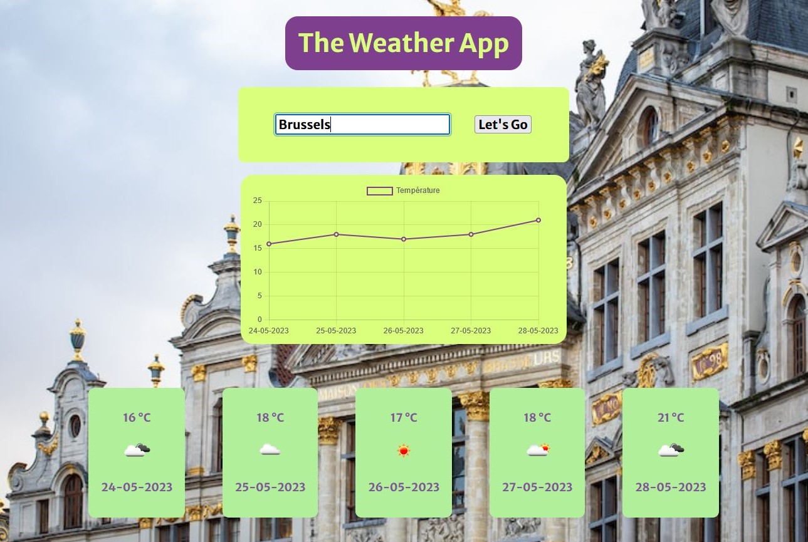

# The_Weather_App

Créer une application qui permet de récupérer une ville et de donner les informations météos pour les 5 prochains jours et inclure un graphique avec ces données.

## Languages

- HTML
- CSS / SCSS
- Javascript (DOM)

## API Reference

Pour la météo :
- https://api.openweathermap.org

Pour la géolocalisation : 
- https://api.api-ninjas.com

Pour les images :
- https://api.unsplash.com

## Github Page

- https://billygrind.github.io/The_Weather_App/

## Screenshots

